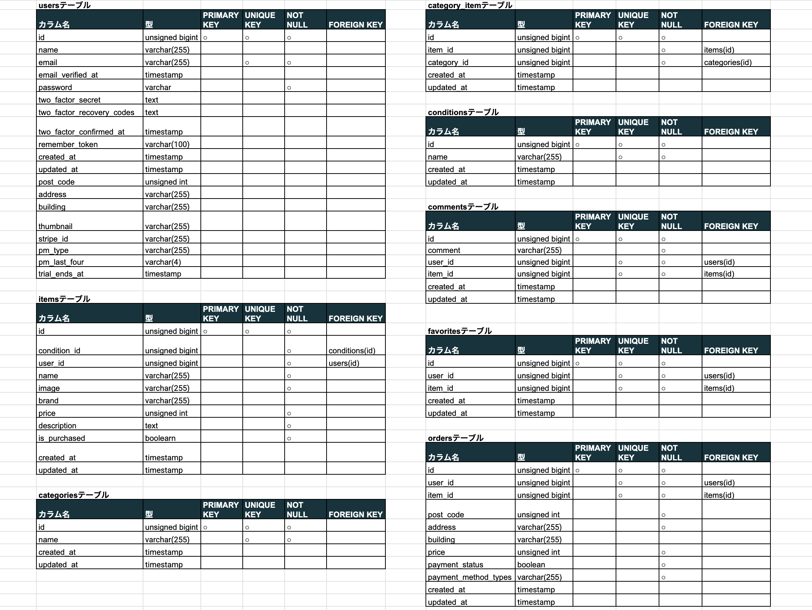
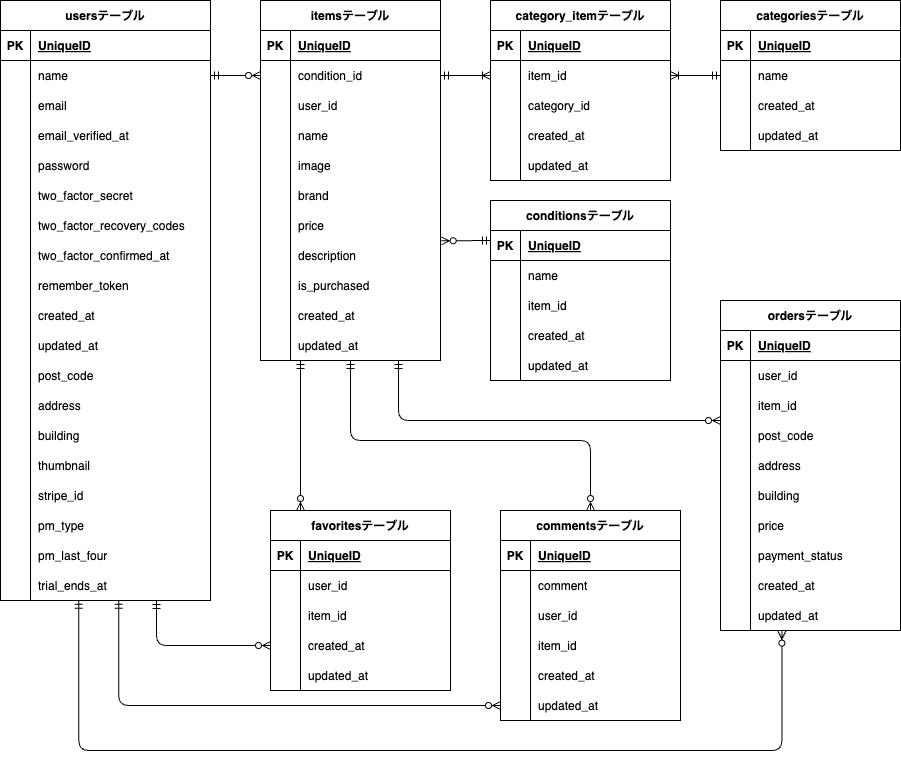

# Coachtechフリマ
企業が開発した独自のフリマアプリです。  
お気に入り登録や検索機能、コメント機能があり、会員登録したユーザーはアイテムの出品も可能です。  
管理者権限でユーザー情報の確認やメールの送信ができます。  


## 作成した目的
coachtechブランドのアイテムを出品・購入するため独自のフリマアプリを開発しました。

## 機能一覧
* 商品一覧取得
* 商品詳細取得
* 検索機能
* 会員登録・ログイン・ログアウト機能
* お気に入り登録機能  
ログイン後に商品のお気に入り登録ができます。
* お気に入り一覧取得  
マイリストからお気に入り登録した商品が確認できます。
* ユーザー情報取得  
マイページから出品した商品、購入した商品が確認できます。
* プロフィール変更  
サムネイル画像、ユーザー名、郵便番号、住所が変更できます。
サムネイル画像はストレージに保存されます。
* 商品コメント追加・削除  
ログイン後に商品に対してコメントすることができます。
* 出品  
商品画像、商品名、ブランド名、カテゴリー、商品の状態、商品の説明、販売価格が設定できます。  
商品の画像はストレージに保存されます。
* 商品購入  
Stripeを利用して商品を購入することができます。  
決済方法は、クレジットカード決済・コンビニ決済・銀行振込から選択できます。  
クレジットカード決済の場合、下記のテストカードを利用して決済ができます。
  ```text
  テスト用カード情報 4242 4242 4242 4242  
  使用期限 任意の数字    セキュリティーコード 任意の数字  
  名前 任意の名前  
  ```
  コンビニ決済・銀行振込の場合は、ページに表示されるリンクから振込方法の確認ができます。  
* 配送先変更  
商品購入ページから配送先の変更ができます。  
配送先はユーザーの住所として登録されます。
* 管理者機能  
管理者ページから管理者権限でログインすると下記機能が使用できます。
  * ユーザー一覧取得
  * ユーザー詳細情報取得
  * お知らせメール、個別メール送信  


## 環境構築
**Dockerビルド**
1. `git clone git@github.com:Haruka-Wada/CoachtechFreemarket.git`
2. DockerDesktopアプリを立ち上げる
3. `docker compose up -d --build`

**Laravel環境構築**
1. `docker compose exec php bash`
2. `composer install`
3. 「.env.example」ファイルを「.env」ファイルに名称変更。または、新しく「.env」ファイルを作成  
4. .envに以下の環境変数を追加
```text
DB_CONNECTION=mysql  
DB_HOST=mysql  
DB_PORT=3306  
DB_DATABASE=laravel_db  
DB_USERNAME=laravel_user  
DB_PASSWORD=laravel_pass  

MAIL_MAILER=smtp
MAIL_HOST=mailhog
MAIL_PORT=1025
MAIL_USERNAME=null
MAIL_PASSWORD=null
MAIL_ENCRYPTION=null
MAIL_FROM_ADDRESS="coachtech-freemarket@example.com"
MAIL_FROM_NAME="${APP_NAME}"
  ```
5. アプリケーションキーの作成
```bash
php artisan key:generate
```
6. マイグレーションの実行
```bash
php artisan migrate
```
7. シーディングの実行
```bash
php artisan db:seed
```
8. その他  
 ストレージに保存した画像を表示するには、シンボリックリンクが必要です。  
 下記コマンドで/src/public内にシンボリックリンクが作成され、画像の表示が可能となります。
```bash
php artisan link:storage
```

## アプリケーションURL
* 開発環境 : http://localhost/  
シーディングで10点のアイテムを登録しています。  
左上のナビゲーションメニューから会員登録が可能です。  
会員ログイン後はマイページからプロフィールを編集できます。  
シーディングでテストユーザーを登録しています。  
  ```text
  メールアドレス : user001@example.com  
  パスワード : pass0001
  
  メールアドレス : user002@example.com  
  パスワード : pass0002
  
  メールアドレス : user003@example.com  
  パスワード : pass0003
  ```
* 管理者ページ　: http://localhost/admin  
シーディングでテストユーザーを登録しています。
  ```text
  名前 : admin001  
  メールアドレス : admin001@example.com  
  パスワード : pass0001
  ```
  管理者ページからメール送信が可能です。  
  お知らせメールは、会員登録しているユーザー全員にメールが送信できます。  
  ユーザー詳細画面からメールを送信すると個別にメールが送信できます。  
  メール機能はMailHogを利用しています。
  * MailHog : http://localhost:8025  
* phpmyadmin : http://localhost:8080

## 使用技術
1. Laravel Framework 8.83.29
2. PHP 7.4.9
3. MYSQL 8.0.26
4. nginx 1.21.1
5. phpmyadmin 5.2.1
6. DockerCompose v2.31.0-desktop.2

## テーブル設計


## ER図
